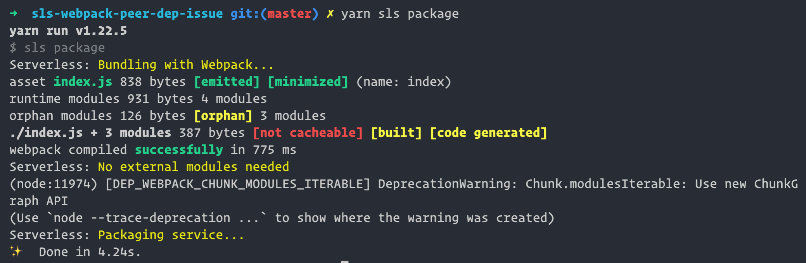
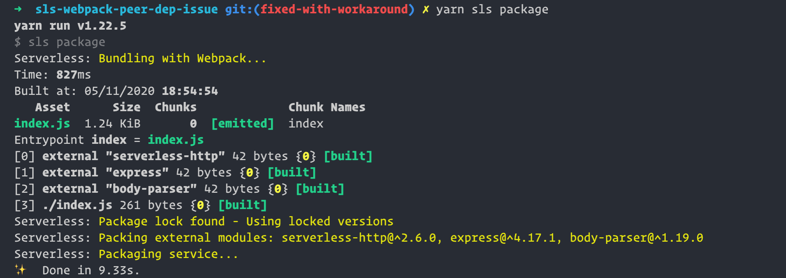

# Peer Dependency Version Issue Demo for serverless-webpack

This repo highlights the issue with serverless-webpack bundling with ES6 import statements.

## Problem:
According to the [documentation](https://github.com/serverless-heaven/serverless-webpack#node-modules--externals), the below configuration should allow to selectively pack only the imported modules:

```javascript
// webpack.config.js
var nodeExternals = require('webpack-node-externals')

module.exports = {
  // we use webpack-node-externals to excludes all node deps.
  // You can manually set the externals too.
  externals: [nodeExternals()],
}
```
```yaml
# serverless.yml
custom:
  webpack:
    includeModules: true # enable auto-packing of external modules
```

But, with the peer dependency `webpack": "^5.4.0`, no npm modules are packaged in the artifacts:


## Workaround

With peer dependency `webpack": "^4.5.1`, it works as expected:


## Caveat

This issue is reproducible only with ES6 `import` statements, `require` statements work as expected
